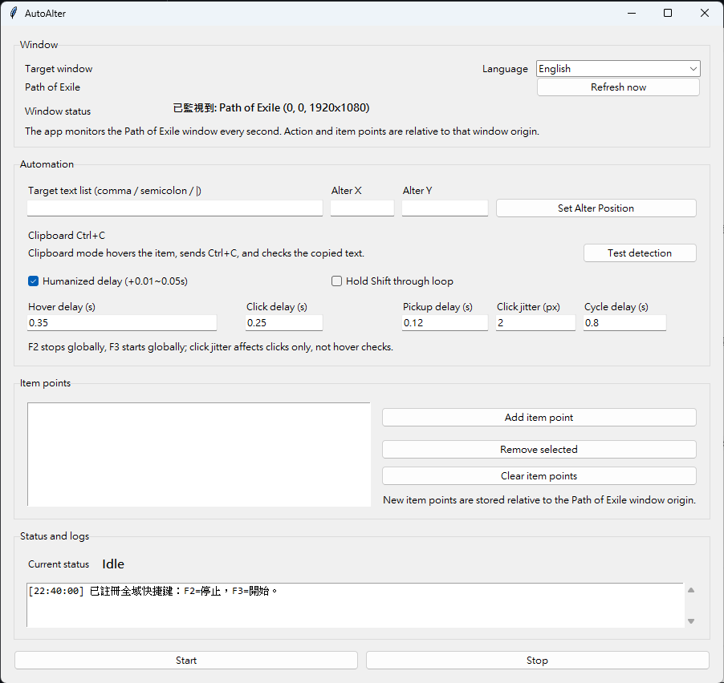

# POEAutoAlter



POEAutoAlter is a Windows desktop automation tool for Path of Exile focused on Alteration Orb rolling with clipboard-based item detection.

## Repo Description

Clipboard-based Path of Exile Alteration Orb automation tool with window monitoring, multi-item routing, and configurable humanized interaction.

## Features

- Monitors the `Path of Exile` window automatically
- Enables `Start` only when the game window is detected
- Stops automatically if the monitored window disappears during a run
- Uses `Ctrl+C` item copy instead of OCR for item checks
- Matches one or more target keywords against copied item text
- Supports multiple item points
- Keeps working on each item point until it matches, then moves to the next one
- Supports an Alteration Orb position for repeated crafting
- Supports optional Shift-hold flow
- Supports click jitter, humanized delay, and a more human-like interaction mode
- Includes stale clipboard protection to reduce extra clicks when the item text has not refreshed yet
- Supports Chinese and English UI

## Requirements

- Windows 10 or Windows 11
- Python 3.11+
- Path of Exile

Recommended:

- Use windowed or borderless mode
- Run the tool with the same privilege level as the game

## Installation

```powershell
python -m pip install -r requirements.txt
```

## Run

```powershell
python app.py
```

or:

```powershell
run.bat
```

## Quick Start

1. Open Path of Exile.
2. Launch the tool.
3. Wait until the monitored window status shows that the game window is detected.
4. Enter one or more target keywords.
5. Set the Alteration Orb position if your flow needs repeated rerolling.
6. Add one or more item points.
7. Adjust timing settings if needed.
8. Click `Start` or press `F3`.

## Detection Flow

This version uses clipboard detection only.

For each check:

1. Move the cursor to the item point.
2. Send `Ctrl+C`.
3. Read the copied item text from the clipboard.
4. Match the result against the target keyword list.

Supported separators for the target keyword list:

- `,`
- `;`
- `|`

## Automation Flow

For each configured item point:

1. Hover the item.
2. Copy item text with `Ctrl+C`.
3. Check for a target match.
4. If matched, mark that item point as complete and move to the next one.
5. If not matched, use the Alteration Orb position and click the item.
6. Copy again and re-check.
7. If the copied text is still unchanged, wait and re-check instead of immediately clicking again.

When all item points are completed, the run stops.

## Window Monitoring

The app checks the `Path of Exile` window once per second.

Behavior:

- If the window is found, `Start` is enabled
- If the window is not found, `Start` is disabled
- If the window disappears during a run, the automation stops

## Coordinate System

All configured positions are relative to the top-left corner of the monitored `Path of Exile` window:

- Alteration Orb position
- Item points

## Timing and Interaction Options

- `Hover delay`: delay before copying item text after hover
- `Click delay`: delay after item click
- `Pickup delay`: delay after using the Alteration Orb position
- `Click jitter`: random click offset in pixels
- `Humanized delay`: adds a small random extra delay to waits
- `Human-like mode`: adds short movement time, more varied pacing, and less rigid retry rhythm
- `Cycle delay`: kept for compatibility with older settings

## Shift Mode

If `Hold Shift through loop` is enabled:

- The tool primes the Alteration Orb action once
- Keeps `Shift` held through the crafting loop
- Releases `Shift` on stop or close

## Hotkeys and Safety

- `F2`: stop
- `F3`: start
- Move the mouse to the top-left corner to trigger the PyAutoGUI failsafe

## Local Configuration

Local settings are stored in `config.json`.

Typical values include:

- target keywords
- Alteration Orb position
- item points
- timing values
- click jitter
- language

`config.json` is ignored by Git.

## Build EXE

This project includes a PyInstaller spec file:

```powershell
python -m PyInstaller --noconfirm POEAutoAlter.spec
```

The built executable is generated in:

- `dist/POEAutoAlter/POEAutoAlter.exe`

Keep the full `dist/POEAutoAlter/` folder together when moving the build.

## Troubleshooting

### Clipboard text does not update correctly

- Make sure the cursor is actually hovering the item
- Make sure the game supports `Ctrl+C` item copy in the current state
- Increase `Hover delay` or `Pickup delay`
- Run the tool with the same privilege level as the game

### Start is disabled

- Make sure Path of Exile is open
- Make sure the window title still contains `Path of Exile`
- Wait for the next monitor refresh or click `Refresh now`

### Clicks feel too rigid

- Increase `Click jitter`
- Enable `Humanized delay`
- Enable `Human-like mode`

## Notes

This project is built around a practical Alteration Orb workflow, not a generic automation framework.
